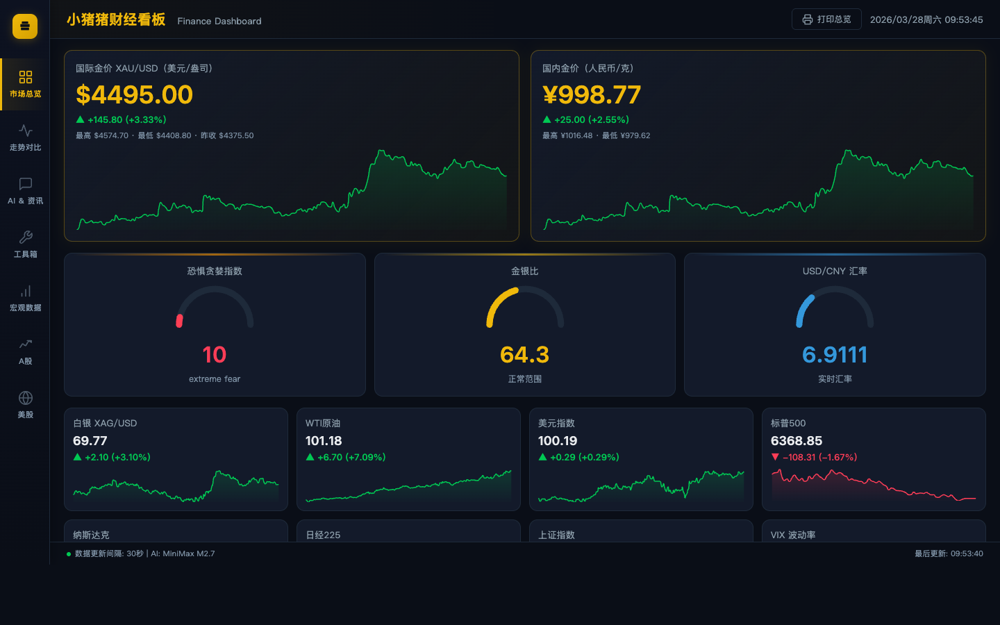

# 小猪猪财经看板

> 个人全市场实时监控面板，覆盖黄金/大宗商品、A股、美股，支持自选股、个股详情、板块热力图、量化信号等功能。



---

## 功能模块

### 行情总览
- 黄金 / 白银 / WTI 原油 / 美元指数 / 标普500 / 纳斯达克 / 日经225 / 上证指数 实时报价
- 恐惧贪婪指数（CNN Fear & Greed）仪表盘
- 金银比仪表盘
- 多资产 K 线对比图（支持 1D / 1W / 1M / 3M / 1Y / 5Y）
- 黄金历史价格区间分析

### A 股
- 六大指数实时行情（上证 / 深成 / 沪深300 / 创业板 / 科创50 / 上证50）
- 热门板块热力图（点击查看板块详情）
  - 多周期收益（1D / 5D / 20D / 60D）vs 沪深300超额收益
  - 板块 K 线走势
  - 板块成分股涨幅排行
- 自选股（本地存储，支持搜索添加，实时刷新）
- 涨停板雷达（实时涨停股 + 原因标签，可点击查看个股详情）
- 龙虎榜（机构/游资资金流向）
- 主题选股（TradingView 6维量化信号：估值/成长/利润/趋势/动量/形态）
- 北向资金实时净流入
- 市场宽度指标（涨跌家数、涨停数）
- 资金流向（主力流入/流出榜）

### 美股
- 六大指数（SPY / QQQ / DIA / IWM / VIX / TNX）实时行情
- SPDR 11个行业 ETF 热力图（点击查看 ETF 详情 + 前10大持仓）
- 自选股（支持搜索任意美股代码）
- 涨跌幅榜 / 成交额榜（实时）
- 主题选股（科技 / 能源 / 金融 / 医疗 / 消费等）
- 市场状态 + 盘前盘后价格

### 个股详情面板（A股 & 美股通用）
- 实时价格、OHLCV
- 历史 K 线（5日内 / 月 / 季 / 年 / 5年）
- 基本面指标（PE / 市值 / 营收增长 / 毛利率 / FCF利润率）
- 6维量化信号评分
- 一键添加/移出自选股

---

## 技术栈

| 层次 | 技术 |
|------|------|
| 前端 | 原生 HTML + CSS + JS，ECharts 5 |
| 后端 | Node.js + Express |
| 数据源 | Yahoo Finance（美股）/ 东方财富 API（A股）/ Sina 财经（A股实时）/ TradingView Scanner API |

---

## 本地部署

```bash
# 克隆项目
git clone https://github.com/piggyzenghz/gold-dashboard.git
cd gold-dashboard

# 安装依赖
npm install

# 启动服务
node server.js

# 浏览器访问
open http://localhost:3000
```

---

## NAS / 服务器部署

### 首次部署

```bash
git clone https://github.com/piggyzenghz/gold-dashboard.git
cd gold-dashboard
npm install

# 后台运行
nohup node server.js > server.log 2>&1 &
```

### 一键更新

```bash
cd gold-dashboard
git pull
# 如有新依赖：npm install
```

### 后台常驻（推荐用 PM2）

```bash
npm install -g pm2
pm2 start server.js --name gold-dashboard
pm2 save
pm2 startup   # 开机自启
```

更新后重启：

```bash
cd gold-dashboard && git pull && pm2 restart gold-dashboard
```

---

## 环境要求

- Node.js 18+
- 端口 3000（可在 `server.js` 顶部修改 `PORT`）
- 需要能访问外网（Yahoo Finance、TradingView Scanner 等）
